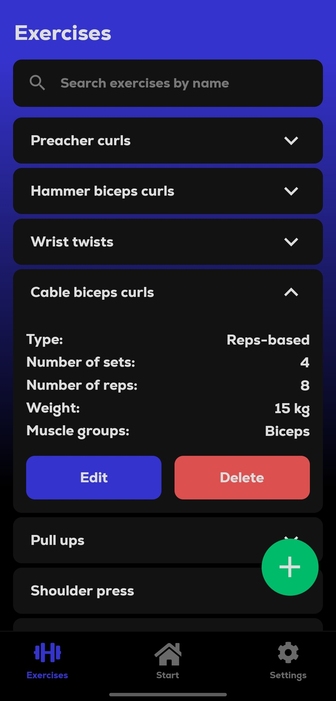
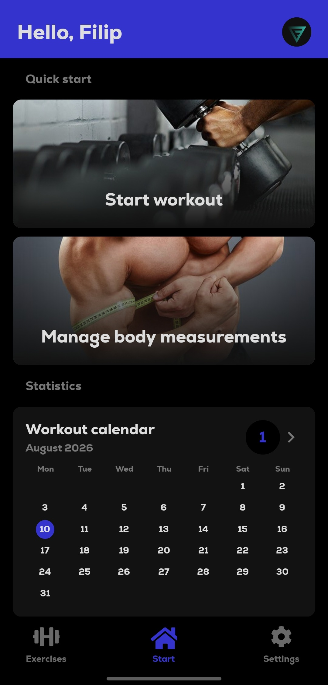
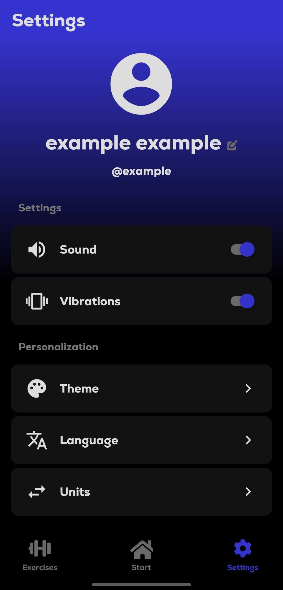

# GymMate

A mobile fitness companion for creating custom workouts, tracking progress, and staying consistent with training routines.

## Features

- create custom exercises with multiple muscle groups, optional notes, and rep-based or time-based variants,
- build workout plans, arrange exercise order, and follow guided set-by-set sessions,
- save body measurements and track essential workout statistics,
- review completed workout activity, monthly totals, and weekly streaks in a calendar stored entirely on the device,
- open daily playlist and weekly podcast recommendations in Spotify,
- browse alphabetically sorted exercises, search them by name, and keep favorites at the top,
- unlock locally stored achievements with in-app and optional system notifications,
- schedule weekly workout reminders and automatic reminders after a longer break,
- use the BMI calculator with visual guidance, expression calculator, and unit converters,
- use a haptic-enabled timer with an optional sound alarm and a stopwatch with lap tracking,
- personalize the profile photo, language, units, theme, sound, and vibration settings.

## Installation

1. **Clone this repository**

   ```bash
   git clone git@github.com:f1shuu/gymmate.git
   ```

2. **Install dependencies**

   ```bash
   npm install
   ```

3. **Start the project**

   ```bash
   npx expo start
   ```

## Download

You can download the latest Android APK from the [Releases](https://github.com/f1shuu/gymmate/releases) page.

## Screenshots

<div align="center" style="display:flex;justify-content:center;gap:10px;flex-wrap:nowrap;">
    
    
    
</div>

## Spotify recommendations

Playlist and podcast suggestions are configured in `constants/spotifyPlaylists.js` and `constants/spotifyPodcasts.js`. Duplicate the provided object structure, give each entry a unique `id`, localized `title`, `author`, and a full `https://open.spotify.com/...` URL, then set `enabled` to `true`. Invalid, empty, or disabled entries are ignored. The app selects playlists once per local calendar day and podcasts once per local week.

## Tech Stack

- **React Native 0.81** and **React 19** for the mobile interface,
- **Expo SDK 54** for development, native APIs, and application builds,
- **React Navigation 7** for tab and stack navigation,
- **AsyncStorage** for persistent local settings and domain data,
- **Expo modules** for audio, fonts, haptics, localization, assets, and gradients,
- **React Native Gesture Handler** and **React Native SVG** for gestures and visual components.

## License

This project is licensed under the MIT License.