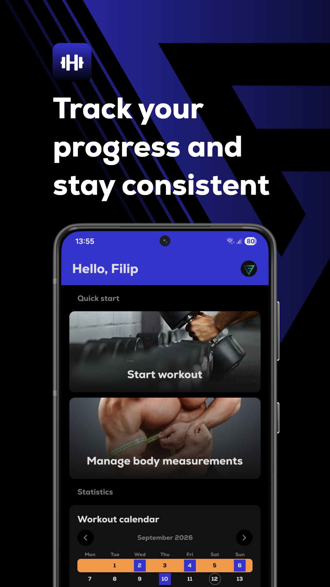
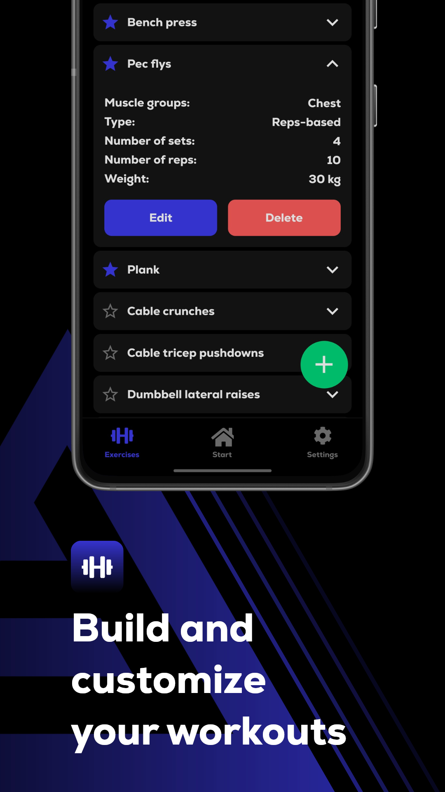
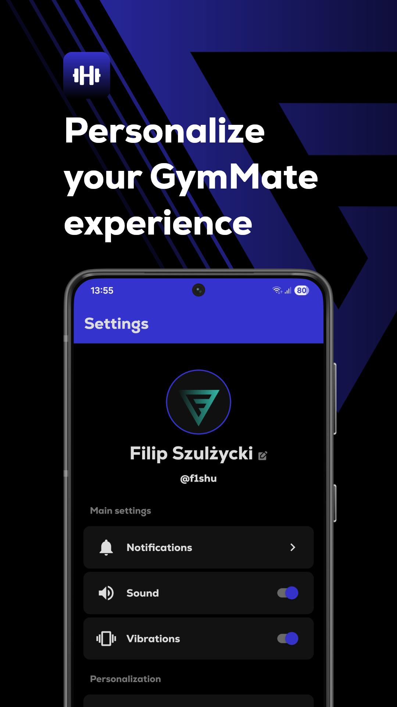

<div align="center">
   
   <h1 align="center">GymMate</h1>

   **A mobile fitness companion for creating custom workouts, tracking progress, and staying consistent with training routines.**

   <p align="center"><a href="https://github.com/f1shuu/gymmate/releases"></a>&nbsp;<a href="LICENSE"></a></p>
</div>

<div align="center" style="display:flex;justify-content:center;gap:10px;flex-wrap:nowrap;">
    
    
    
</div>

## Features

- **custom exercises**: create exercises with multiple muscle groups, optional notes, and rep or time-based variants
- **workout plans**: build and arrange exercises with guided set-by-set sessions
- **progress tracking**: save body measurements and track essential workout statistics
- **activity calendar**: review completed workouts, monthly totals, and weekly streaks stored on device
- **Spotify integration**: open daily playlists and weekly podcast recommendations
- **exercise library**: browse alphabetically sorted exercises, search by name, and favorite top exercises
- **achievements**: unlock locally stored achievements with in-app and system notifications
- **reminders**: schedule weekly workout reminders and automatic prompts after breaks
- **tools**: BMI calculator, expression calculator, unit converters, and haptic timer with stopwatch
- **customization**: personalize profile photo, language, units, theme, sound, and vibration settings

## Download

You can download the latest Android APK from the [Releases](https://github.com/f1shuu/gymmate/releases) page.

## For developers

### Quick start

   ```bash
   git clone git@github.com:f1shuu/gymmate.git
   npm i
   npx expo start
   ```

### Tech stack

- **React Native 0.86** and **React 19** for the mobile interface,
- **Expo SDK 57** for development, native APIs, and application builds,
- **React Navigation 7** for tab and stack navigation,
- **AsyncStorage** for persistent local settings and domain data,
- **Expo modules** for audio, fonts, haptics, localization, assets, and gradients,
- **React Native Gesture Handler** and **React Native SVG** for gestures and visual components.

## License

This project is licensed under the [MIT License](LICENSE).